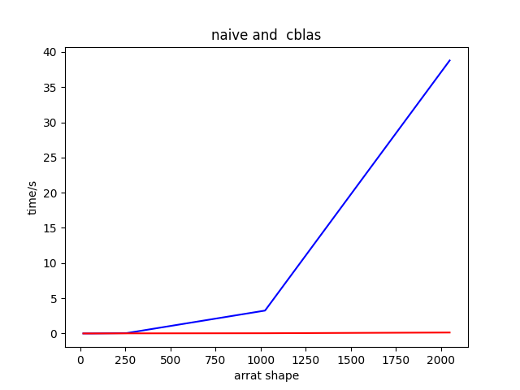

# 高性能计算实验报告(lab2)

姓名：黎俊 ，学号：220110924 ，学期：2023年秋季

## 实验环境介绍

- os:ubuntu20.04
- gcc:(Ubuntu 9.4.0-1ubuntu1~20.04.2) 9.4.0
- cpu:型号：AMD Ryzen 7 5800H with Radeon Graphics，频率：1497.872 MHZ ，核数：8
- 内存：16G

## 实验结果

详见 *time.txt*文件。

测试对比图如下：

对于大规模矩阵，cblas加速效果更加明显。
