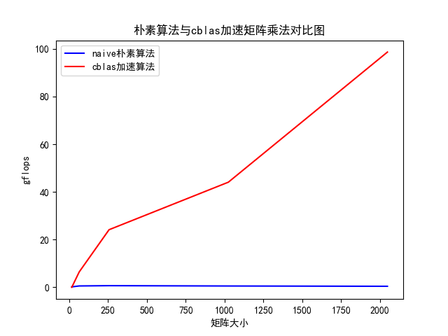

# 高性能计算实验报告(lab2)

姓名：黎俊 ，学号：220110924 ，学期：2023年秋季

## 实验环境介绍

- os:ubuntu20.04
- gcc:(Ubuntu 9.4.0-1ubuntu1~20.04.2) 9.4.0
- cpu:型号：AMD Ryzen 7 5800H with Radeon Graphics，频率：1497.872 MHZ ，核数：8
- 内存：16G

## 实验结果

朴素矩阵乘法size = 16,gflops:0.195048

朴素矩阵乘法size = 64,gflops:0.575508

朴素矩阵乘法size = 256,gflops:0.693159

朴素矩阵乘法size = 1024,gflops:0.555885

朴素矩阵乘法size = 2048,gflops:0.435868

cblas加速矩阵乘法size = 16,gflops:0.017174

cblas加速矩阵乘法size = 64,gflops:6.472691

cblas加速矩阵乘法size = 256,gflops:24.157258

cblas加速矩阵乘法size = 1024,gflops:44.086216

cblas加速矩阵乘法size = 2048,gflops:98.644173

测试对比图如下：

对于大规模矩阵，cblas加速效果更加明显。
