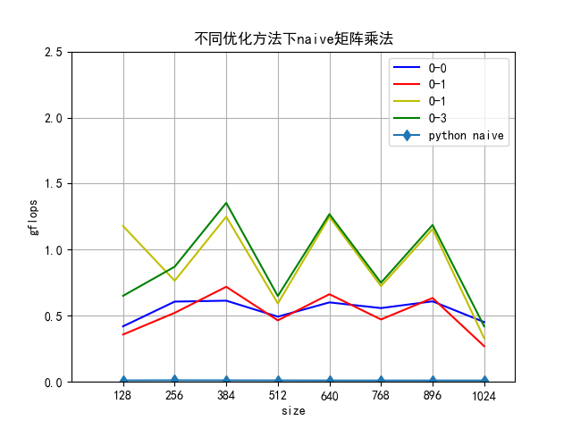
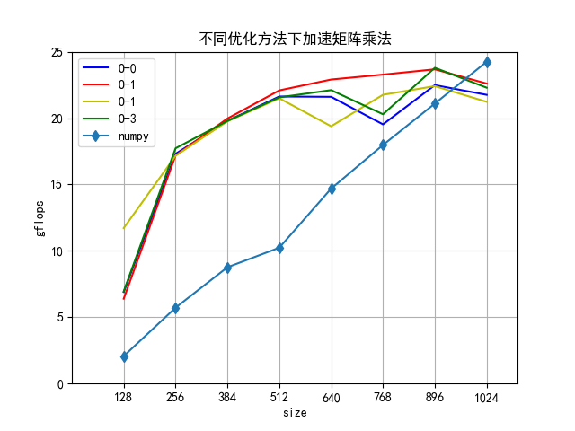

# 高性能计算实验报告(lab3)

姓名：黎俊 ，学号：220110924 ，学期：2023年秋季

## 实验环境介绍

- os:ubuntu20.04
- gcc:(Ubuntu 9.4.0-1ubuntu1~20.04.2) 9.4.0
- cpu:型号：AMD Ryzen 7 5800H with Radeon Graphics，频率：1497.872 MHZ ，核数：8

## 实验结果

本次共测试计算了四种环境下：

- python环境naive矩阵乘法
- Numpy矩阵乘法
- c环境naive矩阵乘法(包括不同优化情况)
- cblas加速矩阵乘法（包括不同优化情况)

矩阵size为128, 256, 384, 512, 640, 768, 896, 1024的每秒浮点运算数gflops。

实验结果详见：*.txt文件

实验结果图：

