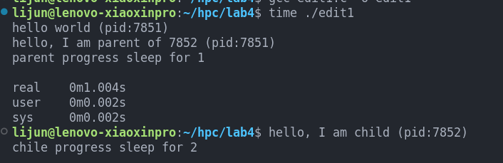
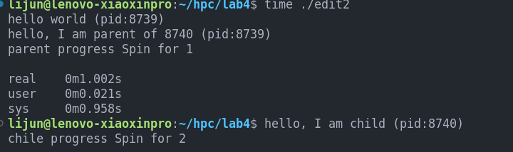

# 高性能计算实验报告(lab4)

姓名：黎俊 ，学号：220110924 ，学期：2023年秋季

## 实验环境介绍

- os:ubuntu20.04
- gcc:(Ubuntu 9.4.0-1ubuntu1~20.04.2) 9.4.0
- cpu:型号：AMD Ryzen 7 5800H with Radeon Graphics，频率：1497.872 MHZ ，核数：8
- 内存：16G

## 具体实验

### 实验一

- 实验设置：父进程sleep(1)，子进程sleep(2)
- 实验结果：
- 实验结果分析:父进程比子进程先结束，每次统计的总时间一致，但是用户态和系统态运行时间不一致。

### 实验二
- 实验设置：父进程Spin(1)，子进程Spin(2)
- 实验结果：
- 实验结果分析:父进程比子进程先结束，每次统计的总时间一致，但是用户态和系统态运行时间不一致。

总结：两次修改总运行时间不一致。