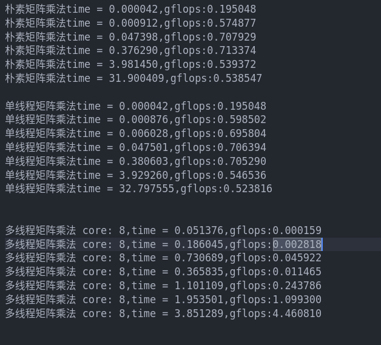

# 高性能计算实验报告(lab5)

姓名：黎俊 ，学号：220110924 ，学期：2023年秋季

## 实验环境介绍

- os:ubuntu20.04
- gcc:(Ubuntu 9.4.0-1ubuntu1~20.04.2) 9.4.0
- cpu:型号：AMD Ryzen 7 5800H with Radeon Graphics，频率：1497.872 MHZ ，核数：8
- 内存：16G

## 具体实验
- 实验一：naive_gemm 朴素矩阵乘法
- 实验二： single_thread_gemm 单线程分块矩阵乘法，将结果矩阵按照cpu cores数从行维度分成8块。
- 实验三： multi_thread_gemm 多线程矩阵乘法 ，将结果矩阵按照cpu cores数从行维度分成8块。将每一个块的运算分别创建一个线程。

## 实验结果

## 实验结果分析
1. 单线程分块矩阵乘法在小规模上与朴素矩阵乘法效率差不多
2. 使用多线程矩阵乘法在cpu利用率上能达到200%，但是在小规模比如size 为24,128的时候效率不如朴素矩阵乘法，原因在于小规模矩阵乘法中创建线程所需时间就比直接计算时间长。