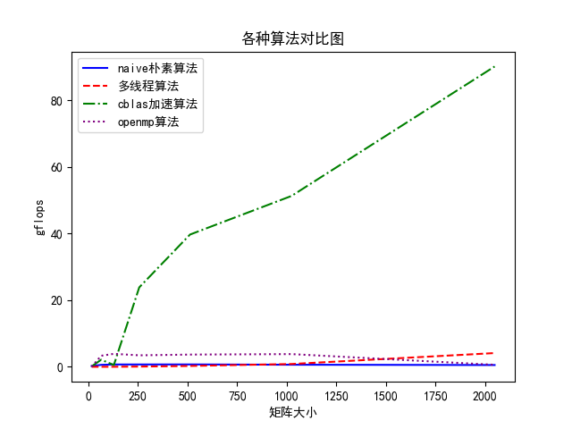

# 高性能计算实验报告(lab6)

姓名：黎俊 ，学号：220110924 ，学期：2023年秋季

## 实验环境介绍

- os:ubuntu20.04
- gcc:(Ubuntu 9.4.0-1ubuntu1~20.04.2) 9.4.0
- cpu:型号：AMD Ryzen 7 5800H with Radeon Graphics，频率：3200 MHZ ，核数：16
- 内存：16G

## 具体实验

- 实验一 朴素矩阵乘法
  ```c
    void navie_gemm(double A[][N],double B[][N],int size)
    {
        for(int i=0;i<size;i++)
            for(int j = 0;j<size;j++)
            {   
                C[i][j]=0 ;
                for(int p=0;p<size;p++)
                    C[i][j] += A[i][p]*B[p][j];

            }

    }
  ```
- 实验二 cblas加速矩阵乘法
  ```c
    cblas_dgemm(CblasColMajor, CblasNoTrans, CblasTrans,size[i],size[i],size[i],1,A, size[i], B, size[i],0,C,size[i]);
  ```
- 实验三 多线程分块矩阵乘法

```c
void gemm(int start_row, int end_row,int size) {
    for (int i = start_row; i < end_row; i++) {
        for (int j = 0; j < size; j++) {
            C[i][j] = 0;
            for (int k = 0; k <size; k++) {
                C[i][j] += A[i][k] * B[k][j];
            }
        }
    }
}

void *thread_multiply(void *args) {
    ThreadArgs *thread_args = (ThreadArgs *)args;
    gemm(thread_args->start_row, thread_args->end_row,thread_args->size);
    pthread_exit(NULL);
}
```

- 实验四 openmp加速矩阵乘法
  ```c
    void gemm(int start_row, int end_row,int size) {
        for (int i = start_row; i < end_row; i++) {
            for (int j = 0; j < size; j++) {
                C[i][j] = 0;
                for (int k = 0; k < size; k++) {
                    C[i][j] += A[i][k] * B[k][j];
                }
            }
        }
    }

    void block_gemm(int size)
    {
        int chunk_size =  size/ core_nums,start_row,end_row;
            #pragma omp parallel for
        for (int i = 0; i < core_nums; i++) {
            start_row = i * chunk_size;
            end_row = (i + 1) * chunk_size;
            gemm(start_row,end_row,size);
        }
    }

  ```

## 实验结果

详见time.txt文件



## 实验结果分析

1. 在最低规模下，朴素矩阵乘法最优
2. cblas加速效果最为明显。
3. openmp加速与多线程分块矩阵乘法，都是通过并行计算利用多个线程实现的，openmp效果优于朴素的多线程乘法。
4. 在低规模下，比如size 为24,128的时候朴素多线程分块矩阵乘法效率不如朴素矩阵乘法，原因在于小规模矩阵乘法中创建线程所需时间就比直接计算时间长。
