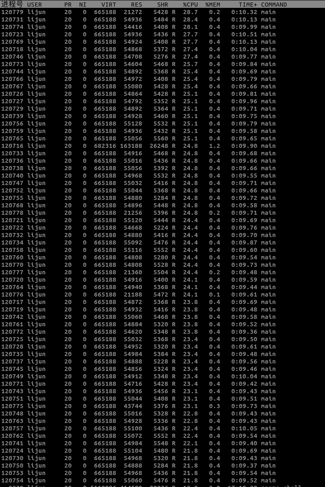

# 高性能计算实验报告(lab7)

姓名：黎俊 ，学号：220110924 ，学期：2023年秋季

## 实验环境介绍

- os:ubuntu20.04
- gcc:(Ubuntu 9.4.0-1ubuntu1~20.04.2) 9.4.0
- cpu:型号：AMD Ryzen 7 5800H with Radeon Graphics，频率：3200MHZ ，核数：8
- 内存：16G
- mpich : 3.3.2

## 实验方案介绍

主进程：
    1. 随机初始化矩阵，根据进程数将矩阵分组，并将矩阵广播到各进程。
    2. 合并各个进程计算后的数据，计算运行时间和gflops

非主进程：
    1. 接受主进程发布的矩阵，进行朴素矩阵乘法计算，并将计算后的结果发送给主进程。

本实验实现了自动计算多组矩阵乘法，也计算了相应的gflops。

## 核心代码

```C
    for (int count =0;count<7;count++){
        int size = scale[count];
        MPI_Comm_rank(MPI_COMM_WORLD,&rank);
        MPI_Comm_size(MPI_COMM_WORLD,&numprocs);
        line = size/numprocs;
        a = (double*) malloc(sizeof(double)*size *size);
        b = (double*) malloc(sizeof(double)*size*size);
        c = (double*) malloc(sizeof(double)*size *size);
        result = (double*) malloc(sizeof(double)*size *line);
        buffer = (double*) malloc(sizeof(double)*size *line);
        srand(time(NULL));
        if (rank==0){
            FILE  *fp;
          fp = fopen("time.txt","a");
            //initialize
            for (int i=0;i<size;i++)
                for(int j=0;j<size;j++){
                    a[i*size +j] =rand()%100+1.0;
                    b[i*size +j] =rand()%100+1.0;
                    c[i*size +j] =0;
                }

            // Initialize a, b, c here

            start = MPI_Wtime();
            //send
            for(int i=1;i<numprocs;i++){
                MPI_Send(b,size*size,MPI_DOUBLE,i,0,MPI_COMM_WORLD);
                MPI_Send(a + (i-1)*size*line,size*line,MPI_DOUBLE,i,1,MPI_COMM_WORLD);
            }
            //receive and combine
            for (int i=1;i<numprocs;i++){
                MPI_Recv(result,line*size,MPI_DOUBLE,i,3,MPI_COMM_WORLD,MPI_STATUS_IGNORE);
                    for (int m=0;m<line;m++){
                        for (int j=0;j<size;j++){
                            c[((i-1)*line+m)*size+j] = result[m*size+j];
                        }
                    }
            }
            for (int i = (numprocs-1)*line;i<size;i++)
                for(int j=0;j<size;j++)
                    for (int k=0;k<size;k++)
                        c[i*size+j] = a[i*size+k] * b[k*size+j];
            end = MPI_Wtime();
            double gflops = 2.0 * size *size*size;
            double duration  = end - start;
            gflops = gflops/duration*1.0e-6/1000;
            fprintf(fp,"mpi矩阵乘法 size= %d,time = %lf,gflops:%lf,progress:%d \n",size,duration,gflops,numprocs);
            fclose(fp);

            }
        else 
        {
            MPI_Recv(b,size*size,MPI_DOUBLE,0,0,MPI_COMM_WORLD,MPI_STATUS_IGNORE);
            MPI_Recv(buffer,line*size,MPI_DOUBLE,0,1,MPI_COMM_WORLD,MPI_STATUS_IGNORE);
            gemm(line,size,result,buffer,b);
            MPI_Send(result,line*size,MPI_DOUBLE,0,3,MPI_COMM_WORLD);
        }
    }

```

## 实验结果

本次实验测试了在设置进程数 np ={2,4,8,16,32,64}下size = {16 ,64, 128,256, 512,1024,2048} 的矩阵乘法时间以及gflops。

实验详细结果见[](time.txt)。

```plaintxt
mpi矩阵乘法 size= 16,time = 0.000051,gflops:0.162074,progress:2 
mpi矩阵乘法 size= 64,time = 0.002478,gflops:0.211607,progress:2 
mpi矩阵乘法 size= 128,time = 0.008864,gflops:0.473175,progress:2 
mpi矩阵乘法 size= 256,time = 0.044480,gflops:0.754366,progress:2 
mpi矩阵乘法 size= 512,time = 0.390888,gflops:0.686732,progress:2 
mpi矩阵乘法 size= 1024,time = 3.483819,gflops:0.616417,progress:2 
mpi矩阵乘法 size= 2048,time = 38.637876,gflops:0.444638,progress:2 

mpi矩阵乘法 size= 16,time = 0.000021,gflops:0.381775,progress:4 
mpi矩阵乘法 size= 64,time = 0.000554,gflops:0.946631,progress:4 
mpi矩阵乘法 size= 128,time = 0.003914,gflops:1.071714,progress:4 
mpi矩阵乘法 size= 256,time = 0.027244,gflops:1.231612,progress:4 
mpi矩阵乘法 size= 512,time = 0.210932,gflops:1.272617,progress:4 
mpi矩阵乘法 size= 1024,time = 1.967031,gflops:1.091739,progress:4 
mpi矩阵乘法 size= 2048,time = 20.493773,gflops:0.838297,progress:4 

mpi矩阵乘法 size= 16,time = 0.000083,gflops:0.098171,progress:8 
mpi矩阵乘法 size= 64,time = 0.000338,gflops:1.550792,progress:8 
mpi矩阵乘法 size= 128,time = 0.002344,gflops:1.789643,progress:8 
mpi矩阵乘法 size= 256,time = 0.013617,gflops:2.464194,progress:8 
mpi矩阵乘法 size= 512,time = 0.117194,gflops:2.290519,progress:8 
mpi矩阵乘法 size= 1024,time = 1.260919,gflops:1.703110,progress:8 
mpi矩阵乘法 size= 2048,time = 12.008994,gflops:1.430584,progress:8 

mpi矩阵乘法 size= 16,time = 0.000704,gflops:0.011636,progress:16 
mpi矩阵乘法 size= 64,time = 0.000469,gflops:1.116822,progress:16 
mpi矩阵乘法 size= 128,time = 0.002921,gflops:1.435862,progress:16 
mpi矩阵乘法 size= 256,time = 0.010491,gflops:3.198507,progress:16 
mpi矩阵乘法 size= 512,time = 0.112782,gflops:2.380137,progress:16 
mpi矩阵乘法 size= 1024,time = 1.044110,gflops:2.056761,progress:16 
mpi矩阵乘法 size= 2048,time = 8.606197,gflops:1.996221,progress:16 

mpi矩阵乘法 size= 16,time = 0.015834,gflops:0.000517,progress:32 
mpi矩阵乘法 size= 64,time = 0.027760,gflops:0.018886,progress:32 
mpi矩阵乘法 size= 128,time = 0.192547,gflops:0.021783,progress:32 
mpi矩阵乘法 size= 256,time = 0.145775,gflops:0.230179,progress:32 
mpi矩阵乘法 size= 512,time = 0.559561,gflops:0.479725,progress:32 
mpi矩阵乘法 size= 1024,time = 1.785684,gflops:1.202611,progress:32 
mpi矩阵乘法 size= 2048,time = 10.379193,gflops:1.655222,progress:32 

mpi矩阵乘法 size= 16,time = 0.062187,gflops:0.000132,progress:64 
mpi矩阵乘法 size= 64,time = 0.047820,gflops:0.010964,progress:64 
mpi矩阵乘法 size= 128,time = 0.987498,gflops:0.004247,progress:64 
mpi矩阵乘法 size= 256,time = 2.046944,gflops:0.016392,progress:64 
mpi矩阵乘法 size= 512,time = 3.480099,gflops:0.077134,progress:64 
mpi矩阵乘法 size= 1024,time = 8.829051,gflops:0.243229,progress:64 
mpi矩阵乘法 size= 2048,time = 30.610532,gflops:0.561240,progress:64 

```


由实验可以看到在进程数2-16时，随着进程数增加，计算时间减少，gflops增加，但是当进程数继续增加时候，计算时间反而增加，gflops下降。


当进程数为64时，利用top命令观察cpu使用情况如下：


可以看到进程数过多，cpu使用率比较低。推测原因在于，本机cpu核是有限的，适用的最佳最大进程数是有限的，当进程数过多，超过了这一个阈值，就会有多进程运行在同一个cpu上，会发生进程切换等操作，因此所耗时间增加，一台cpu的性能被多个进程均分了，使用效率因此下降。

