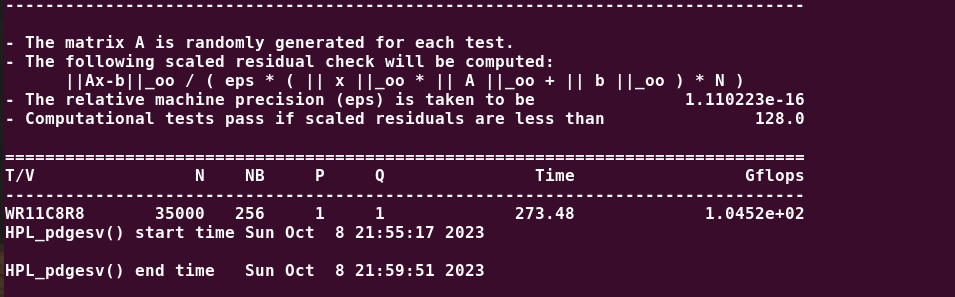
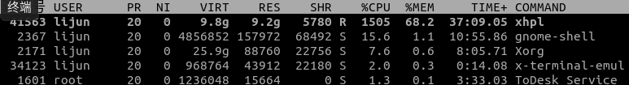

# 高性能计算实验报告(lab8)

姓名：黎俊 ，学号：220110924 ，学期：2023年秋季

## 实验环境介绍

- os:ubuntu20.04
- gcc:(Ubuntu 9.4.0-1ubuntu1~20.04.2) 9.4.0
- cpu:型号：AMD Ryzen 7 5800H with Radeon Graphics，频率：3200MHZ ，核数：8
- 内存：16G

## CPU理论峰值计算

要计算AMD Ryzen 7 5800H 的理论峰值GFLOPS，我们需要考虑以下几个因素：
    1. 每个核心的时钟频率（Clock Speed）：它的基础时钟频率是 3200 MHz。
    2. 每个核心的FLOP/Cycle：对于大多数现代处理器，每个时钟周期可以执行多个FLOP。每个FMA执行单元可以执行两个FLOP（一个FMA操作相当于两个FLOP）。
    3. 核心数量：AMD Ryzen 7 5800H 有8个核心。
    4. SIMD指令集：如果使用了SIMD指令集（如AVX2），则可以在每个FMA执行单元上执行两个FMA操作。

- 首先，我们计算每个核心的理论峰值GFLOPS：
  每个核心的FLOP/Cycle * 时钟频率 = 2 FLOP/Cycle * 3200 MHz = 6400 MFLOPS
- 然后，将每个核心的GFLOPS乘以核心数量：
  GFLOPS = 6400 MFLOPS/core * 8 cores = 51200 MFLOPS = 51.2 GFLOPS
- 如果应用程序可以使用AVX2指令集，那么每个FMA执行单元可以执行两个FMA操作，GFLOPS将会翻倍：
  GFLOPS = 6400 MFLOPS/core * 2 (因为AVX2) * 8 cores = 102400 MFLOPS = 102.4 GFLOPS

所以，根据上述计算，你的AMD Ryzen 7 5800H 在理论上可以达到约 51.2 GFLOPS（如果不使用AVX2）或约 102.4 GFLOPS（如果使用AVX2）。

## 软件依赖

1. gcc: version 9.4.0 (Ubuntu 9.4.0-1ubuntu1~20.04.2)
2. mpi: mpicc for MPICH version 3.3.2
3. openblas : libopenblas-dev  (0.3.8+ds-1ubuntu0.20.04.1)。
4. gnu fortran : GNU Fortran (Ubuntu 9.3.0-8ubuntu1) 9.3.0
5. atlas : version 3.10.3

## HPC测试

采用mpitch + atlas测试。

调参技巧：尽可能把NS往大的调，可以根据top查看测试程序在运行时所占的内存大小，调到百分之65比较合适。

