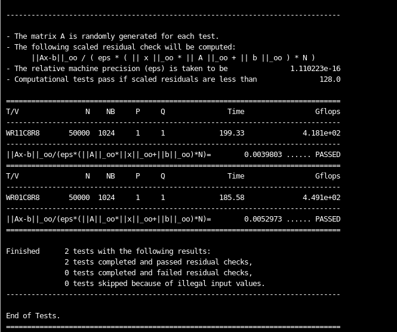
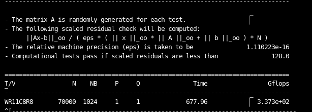
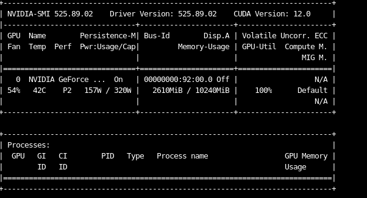
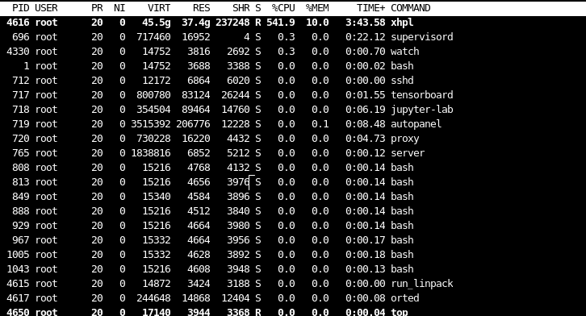

# 高性能计算实验报告(lab9)GPU HPL测试

姓名：黎俊 ，学号：220110924 ，学期：2023年秋季

## 实验环境介绍

- os:ubuntu20.04
- gcc:(Ubuntu 9.4.0-1ubuntu1~20.04.2) 9.4.0
- gpu: 型号：NVIDIA RTX 3080显卡
- cuda:11.3
- intelmkl : 采用官网最新版
- openmpi : 1.10.7

# 遇到的小问题

GPU上HPL测试与cpu上的不一样，我是参考的[GPU-HPL测试](https://blog.csdn.net/liu_feng_zi_/article/details/107429720)这篇文章搭建的环境进行测试的。


遇到问题有：
1. 需要安装intel mkl库，但是我只在官网找到最新版的oneapi下的mkl库。但是全部安装内存总共需要7G，本机系统内存不够，所以我开了一个云服务器进行测试。一般云服务器上显卡驱动以及cuda都安装好了，因此不需要再重复安装。

2. 在准备进行测试的时候有很多链接库文件报错找不到，因此我还一个一个找到了文件路径，将其加入了系统环境变量。

3. 按照博文教程安装的openmpi版本是4.7的，但是我们测试文件会在编译过程中报错，只支持3.0一下版本，于是我再重新安装了1.10.7版本最后成功编译。

4. 在进行mpirun -np 8 以8进程进行测试时，观察到系统首先需要处理xhpl文件，所耗时间长，于是没有继续测量而是改成了单节点测试根据lab8的调参经验，设大了问题规模。

遇上没有找到的库文件，可以使用
```bash
find / -name "libdgemm.so.1" 2>/dev/null
```
找到路径再加入环境变量即可。
# HPC测试

在网上看到的3080支持的双精度gflops在400左右，与实际实验测量吻合，以下是实验结果截图。




